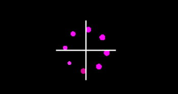

基于 [此文](http://lamyoung.com/cocos-creator/2020/04/13/ccc-shader-animation/) 的实践，并记录遇到的问题。


## 最终效果

中间放了两个单色精灵做 x，y 坐标系，方便观察。



完整 `effect`  文件：

```
// Copyright (c) 2017-2018 Xiamen Yaji Software Co., Ltd.

CCEffect %{
  techniques:
  - passes:
    - vert: vs
      frag: fs
      blendState:
        targets:
        - blend: true
      rasterizerState:
        cullMode: none
      properties:
        texture: { value: white }
        alphaThreshold: { value: 0.5 }
}%


CCProgram vs %{
  precision highp float;

  #include <cc-global>
  #include <cc-local>

  in vec3 a_position;
  in vec4 a_color;
  out vec4 v_color;

  #if USE_TEXTURE
  in vec2 a_uv0;
  out vec2 v_uv0;
  #endif

  void main () {
    vec4 pos = vec4(a_position, 1);

    #if CC_USE_MODEL
    pos = cc_matViewProj * cc_matWorld * pos;
    #else
    pos = cc_matViewProj * pos;
    #endif

    #if USE_TEXTURE
    v_uv0 = a_uv0;
    #endif

    v_color = a_color;

    gl_Position = pos;
  }
}%


CCProgram fs %{
  precision highp float;

  #include <alpha-test>
  #include <cc-global> // 定义了 cc_time

  in vec4 v_color;

  #if USE_TEXTURE
  in vec2 v_uv0;
  uniform sampler2D texture;
  #endif

  float circle(in vec2 uv, in float r) {
    float d = 0.01 * r;
    return 1.0 - smoothstep(r - d, r + d, length(uv));
  }

  void main () {

    vec2 uv= v_uv0 - 0.5;
    float time = cc_time.x;

    const float PI = 3.1416926;
    float R = 0.35;
    float radius = 0.05;
    vec2 pos = vec2(0, 0);
    float count = 8.0;
    float rotation = 0.0;

    vec4 o = vec4(0, 0, 0, 0);
    for (float i = 0.0; i < 8.0; i++) {
        rotation = 2.0 * PI * i / count + time * 2.0 * PI / 4.0;
        pos = vec2(R * cos(rotation), R * sin(rotation));
        o.a += circle(uv - pos, radius * (sin(rotation*0.45)+1.0)/3.0 + radius/3.0);

        o.r += o.a * (sin(i/count + time + PI*6.0/3.0)+ 1.0)/2.0;
        o.g += o.a * (sin(i/count + time + PI*4.0/3.0)+1.0)/2.0;
        o.b += o.a * (sin(i/count + time + PI*2.0/3.0)+1.0)/2.0;
    }

    o *= v_color;

    ALPHA_TEST(o);

    gl_FragColor = o;
  }
}%

```


## 问题

1. 'x' :  field selection requires structure or vector on left hand side:

  根本原因是 `cc_time`  未定义，`#include <cc-global>` 解决问题。

  思路：

  1.1	查看最终的 `shader` 字符串，输出 `vert` & `frag`。**重新打开 creator 项目**。

  ```
                          cc.log('----vert----\n' + vert);
                          cc.log('----frag----\n' + frag);
  ```

  1.2 在 [JS 引擎目录](../base/0.folder-structure.md) 搜索，看看 `cc_time` 定义的地方。

  ​

  <details>
  <summary>详细信息</summary>

  ```
  'x' :  field selection requires structure or vector on left hand side:
    float time = cc_time.x;
    at /Applications/CocosCreator.app/Contents/Resources/engine/bin/.cache/dev/cocos2d/renderer/core/program-lib.js:247:36
    at Array.forEach (<anonymous>)
    at ProgramLib.getProgram (/Applications/CocosCreator.app/Contents/Resources/engine/bin/.cache/dev/cocos2d/renderer/core/program-lib.js:241:36)
    at ForwardRenderer._draw (/Applications/CocosCreator.app/Contents/Resources/engine/bin/.cache/dev/cocos2d/renderer/core/base-renderer.js:463:54)
    at ForwardRenderer._drawItems (/Applications/CocosCreator.app/Contents/Resources/engine/bin/.cache/dev/cocos2d/renderer/renderers/forward-renderer.js:349:38)
    at ForwardRenderer._opaqueStage (/Applications/CocosCreator.app/Contents/Resources/engine/bin/.cache/dev/cocos2d/renderer/renderers/forward-renderer.js:377:30)
    at ForwardRenderer._render (/Applications/CocosCreator.app/Contents/Resources/engine/bin/.cache/dev/cocos2d/renderer/core/base-renderer.js:384:29)
    at ForwardRenderer.render (/Applications/CocosCreator.app/Contents/Resources/engine/bin/.cache/dev/cocos2d/renderer/renderers/forward-renderer.js:155:34)
    at Function.RenderFlow.render (/Applications/CocosCreator.app/Contents/Resources/engine/bin/.cache/dev/cocos2d/core/renderer/render-flow.js:187:22)
  ```
  </details>

  2. 球一直是白色，没有颜色变化

  原因是新建的 effect 默然创建的 `vec4 o = vec4(1, 1, 1, 1)` 是白色的，绘制小球时，一直叠加 `gba` ，还是白色。
  故初始化 o 为透明黑色：

  ```
  vec4 o = vec4(0, 0, 0, 0);
  ```

## 疑问

  1. 为什么使用 `o.a += ...` 而不是 `o.a = ...`
  2. 为什么使用 `o.r += o.a * ...` 而不是 `o.r = ...`


## 感谢

  1. http://lamyoung.com/cocos-creator/2020/04/13/ccc-shader-animation/
  2. https://www.jianshu.com/p/49340651ce04