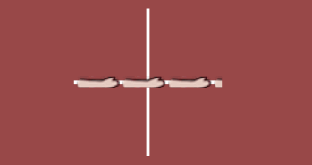
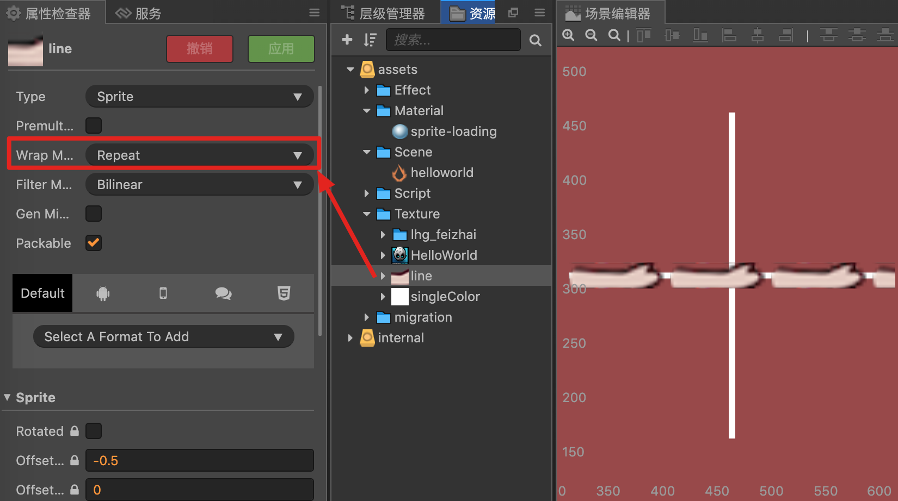

## uv 动画之纹理移动

### 效果



### 代码

  <details>
  <summary>shader 根据 cc_time.x 进行 uv 位移</summary>

```c
// Copyright (c) 2017-2018 Xiamen Yaji Software Co., Ltd.

CCEffect %{
  techniques:
  - passes:
    - vert: vs
      frag: fs
      blendState:
        targets:
        - blend: true
      rasterizerState:
        cullMode: none
      properties:
        texture: { value: white }
        alphaThreshold: { value: 0.5 }
        uv_offset: {value: [0.0, 0.0]} // 由程序传入的变量
}%


CCProgram vs %{
  precision highp float;

  #include <cc-global>
  #include <cc-local>

  in vec3 a_position;
  in vec4 a_color;
  out vec4 v_color;

  #if USE_TEXTURE
  in vec2 a_uv0;
  out vec2 v_uv0;
  #endif

  void main () {
    vec4 pos = vec4(a_position, 1);

    #if CC_USE_MODEL
    pos = cc_matViewProj * cc_matWorld * pos;
    #else
    pos = cc_matViewProj * pos;
    #endif

    #if USE_TEXTURE
    v_uv0 = a_uv0;
    #endif

    v_color = a_color;

    gl_Position = pos;
  }
}%


CCProgram fs %{
  precision highp float;

  #include <alpha-test>
  #include <cc-global>

  in vec4 v_color;


  #if USE_TEXTURE
  in vec2 v_uv0;
  uniform sampler2D texture;
  #endif

  float circle(in vec2 uv, in float r) {
    float d = 0.01 * r;
    return 1.0 - smoothstep(r - d, r + d, length(uv));
  }

  uniform LIGHT {
    //
    vec2 uv_offset;
  };

  void main () {

    vec2 uv = v_uv0;

    float time = cc_time.x;

    const float PI = 3.1416926;
    float R = 0.35;
    float radius = 0.05;
    vec2 pos = vec2(0, 0);
    float count = 8.0;
    float rotation = 0.0;

    // uv *= sin(time);
    float x = cc_time.x;

    vec4 o = vec4(1, 1, 1, 1);
    #if USE_TEXTURE
    // o *= texture(texture, uv + uv_offset); // 外部传入的变量
    o *= texture(texture, uv + vec2(-x,0));
    #endif

    o *= v_color;

    ALPHA_TEST(o);

    gl_FragColor = o;
  }
}%

```

</details>

纹理设置为循环纹理



----


  <details>
  <summary>由程序控制 `uv` 的移动</summary>

  ```c
    cc.Class({
        extends: cc.Component,

        properties: {

            // 材质对象
            materi: cc.MaterialVariant,
            sp: cc.Sprite,
        },

        start () {
            this._materi = this.sp.getMaterial(0);
            this._uv_offset = cc.v2(0,0);
        },

        update (dt) {
            this._uv_offset = cc.v2(this._uv_offset.x + 0.01, 0); // 计算偏移
            this._materi.effect.setProperty('uv_offset', this._uv_offset); // 传递给 shader
        },
    });
  ```
  </details>